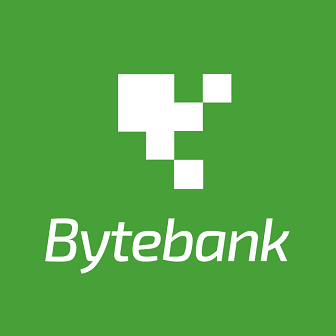

<h1 align="center">
    
</h1>

<h4 align="center"> 
  🤑💲  Alura Byte Bank  🤑💲
</h4>

<p align="center">
 <a href="#-sobre-o-projeto">Sobre o projeto</a> •
 <a href="#%EF%B8%8F-funcionalidades">Funcionalidades</a> •
 <a href="#-como-executar-o-projeto">Como executar o projeto</a> •
 <a href="#pr%C3%A9-requisitos">Pré-requisitos</a> •
 <a href="#-tecnologias">Tecnologias</a> •
 <a href="#-autor">Autor</a> •
</p>


## 💻 Sobre o projeto

Byte Bank é um projeto em que as funcionalidades estão sendo desenvolvidas por meio dos cursos da [Alura](https://www.alura.com.br/) em [Formação em Flutter](https://www.alura.com.br/formacao-flutter) onde consiste num aplicativo de banco onde se pode cadastrar contatos e realizar transferências para eles.

---

## ⚙️ Funcionalidades

- [x] Cadastro de contatos
- [x] Realização de transações
- [x] Integração com Web Api

---

## 🚀 Como executar o projeto
   ```
   - Entre no diretório:
   $ cd alura-byte-bank
   - Instale as dependências:
   $ flutter pub get
   - Execute:
   $ flutter run
   ```
   
---

### Pré-requisitos

Conhecer o paradigma de programação Orientada a Objetos é o essencial, seja em Dart ou em qualquer linguagem do mesmo paradigma, como por exemplo Java, C# entre outras comuns no mercado.

Antes de começar, configure o ambiente de desenvolvimento na sua máquina, instalando o [Flutter](https://flutter.dev/docs/get-started/install)

## 🛠 Tecnologias

As seguintes ferramentas foram usadas na construção do projeto:

-   **[Flutter](https://flutter.dev/)**

---

## 🦸 Autor

 
 <span><b>Leonardo Molina</b></span>

 [](https://www.linkedin.com/in/leomolina0501/) [](https://twitter.com/leoomolina_) [](https://www.instagram.com/leomolina_/)

---
